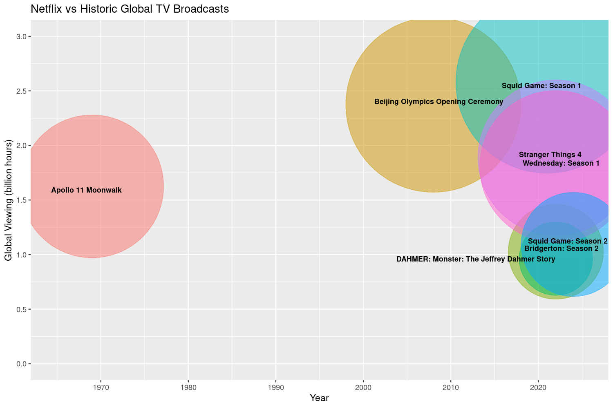

# Netflix's Most Popular Shows (R)

Which are Netflix's Top 10 most popular shows of all time? How does the global audience for these titles compare to historic global TV broadcasts?  

To find out, I used R to analysed data for 2,600 Netflix titles and uncovered some fascinating insights.  

### 💡 Key findings:
- Humanity has spent more time watching *'Squid Game: Season 1'* than the historic moon landings 🌕  
- Live TV isn’t dead yet! 📺 *'Stranger Things 4'* viewership took a dramatic hit during World Cup qualifying matches ⚽  

### 📊 Analytical approach:
 - **Data Wrangling:** cleaned and structured the dataset for analysis  
 - **Exploratory Data Analysis:** identified trends and outliers in viewership data  
 - **Visualisation:** used *ggplot2* to create compelling charts highlighting key trends  

### 🔗 Project Resources:
📖 Jupyter Notebook: [GitHub](https://github.com/dpb24/Netflix-most-popular-shows/blob/main/netflix-most-popular-shows.ipynb)  
📂 Dataset: [Netflix Global Top 10 weekly dataset](https://www.kaggle.com/datasets/davidpbriggs/most-popular-netflix-shows)  
📊 Project also available on: [Kaggle](https://www.kaggle.com/code/davidpbriggs/netflix-most-popular-shows)  

    

